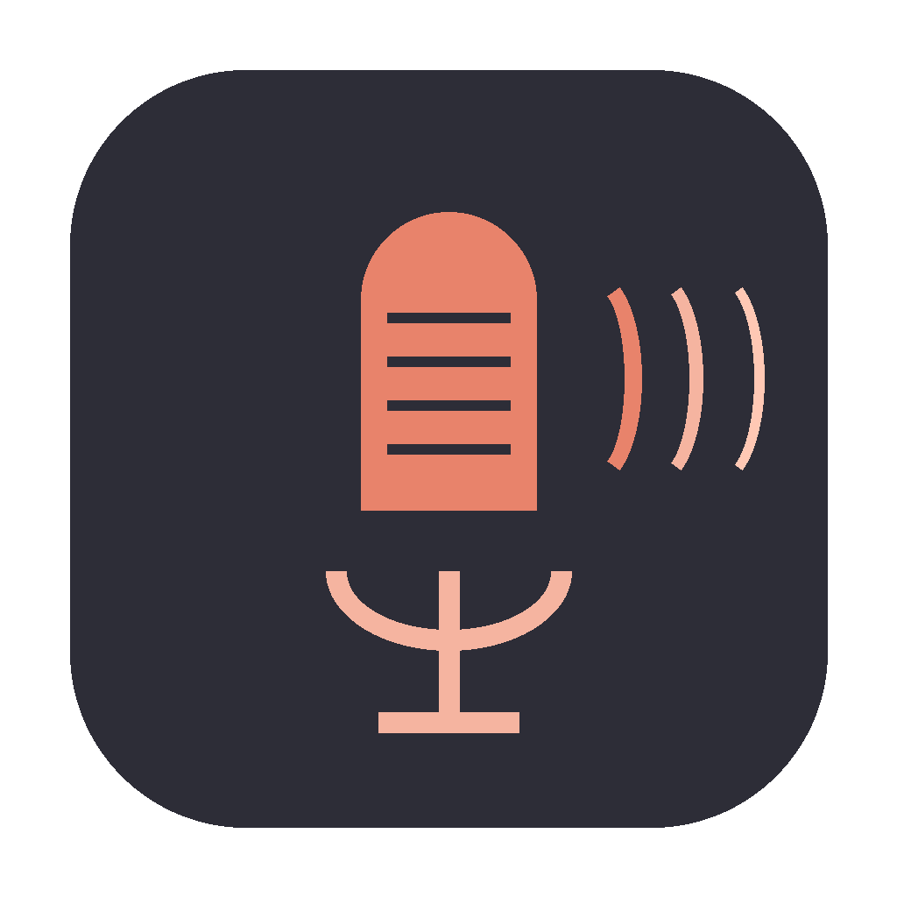

# Hey Claude - Voice Command System

<p align="center">
  
</p>

<p align="center">
  Always-on macOS voice assistant that listens for "Hey Claude" and executes commands via Claude Code.
</p>

<p align="center">
  
</p>

## Features

- Wake word detection ("Hey Claude") using Picovoice Porcupine
- Natural voice commands with "over" end trigger (or 2-second pause)
- Automatic Claude Code execution in new iTerm tab
- Voice responses via VoiceMode MCP (Whisper + Kokoro TTS)
- Runs as background app (no terminal window needed)
- Sound + notification when wake word detected
- Built-in mic support to avoid Bluetooth audio quality issues

## Prerequisites

- **macOS** with Apple Silicon (M1/M2/M3/M4)
- **Python 3.10+**
- **Homebrew** (for installing terminal-notifier)
- **[Claude Code CLI](https://docs.anthropic.com/en/docs/claude-code)** installed and configured
- **[VoiceMode MCP](https://github.com/mbailey/voicemode)** installed and running
- **[Picovoice](https://picovoice.ai/)** account (free tier)
- **iTerm2** (recommended) or Terminal.app

## Installation

### 1. Clone & Install Dependencies

```bash
git clone https://github.com/SergeyKirk/hey-claude.git
cd hey-claude
./hey-claude.sh install
```

### 2. Get Picovoice Wake Word

1. Go to [console.picovoice.ai](https://console.picovoice.ai/)
2. Sign up (free) and copy your **Access Key**
3. Go to **Porcupine > Custom Wake Word**
4. Type "Hey Claude", select **macOS (arm64)**, download the `.ppn` file

### 3. Set Up Wake Word Model

```bash
mkdir -p wake-word
mv ~/Downloads/Hey-Claude_*.ppn wake-word/hey-claude.ppn
```

### 4. Configure

```bash
cp config.yaml.example config.yaml
```

Edit `config.yaml` and add your Picovoice access key:
```yaml
picovoice:
  access_key: "your-access-key-here"
```

### 5. Test (Foreground Mode)

```bash
./hey-claude.sh run
```

Say "Hey Claude" - if it detects your voice, you're ready for the next step.

### 6. Build Background App

```bash
./hey-claude.sh build-app
./hey-claude.sh start-app
```

On first launch, grant microphone permission when prompted.

### 7. Auto-Start at Login (Optional)

**Option A - Via System Settings:**
1. Open **System Settings > General > Login Items**
2. Click **+** under "Open at Login"
3. Select `dist/Hey Claude.app`

**Option B - Via Terminal:**
```bash
osascript -e 'tell application "System Events" to make login item at end with properties {path:"'$(pwd)'/dist/Hey Claude.app", hidden:false}'
```

## Usage

1. Say **"Hey Claude"** to activate
2. Speak your command naturally
3. Say **"over"** to finish (or pause for 2 seconds)
4. Claude executes in a new iTerm tab and responds via voice

### Example Commands

- "Hey Claude, what time is it, over"
- "Hey Claude, create a Python function to sort a list, over"
- "Hey Claude, explain this error, over"

## Commands

```bash
./hey-claude.sh install     # Install dependencies
./hey-claude.sh run         # Run in foreground (testing)
./hey-claude.sh build-app   # Build background app
./hey-claude.sh start-app   # Start background app
./hey-claude.sh stop-app    # Stop background app
./hey-claude.sh status      # Check if running
./hey-claude.sh logs        # View logs
```

## Configuration

Edit `config.yaml`:

```yaml
picovoice:
  access_key: "YOUR_KEY"
  wake_word_model: "wake-word/hey-claude.ppn"

command:
  end_keyword: "over"
  silence_timeout: 2.0

audio:
  input_device: "default"  # Or "MacBook Pro Microphone"

terminal:
  app: "iterm"
```

### Bluetooth Audio Fix

If Bluetooth headphones sound bad when Hey Claude runs, use the built-in mic:

```yaml
audio:
  input_device: "MacBook Pro Microphone"
```

## Troubleshooting

### Wake word not detected
- Check microphone permissions in System Settings
- Verify `wake-word/hey-claude.ppn` exists
- Run `./hey-claude.sh run` to see debug output

### App doesn't start
- Run `./hey-claude.sh build-app` first
- Check Console.app for crash logs

### VoiceMode keeps talking after closing iTerm
- Run: `pkill -f "kokoro\|tts"`

## License

MIT License - See [LICENSE](LICENSE)

---

Built with [Picovoice Porcupine](https://picovoice.ai/platform/porcupine/), [Whisper.cpp](https://github.com/ggerganov/whisper.cpp), and [Claude Code](https://docs.anthropic.com/en/docs/claude-code)
